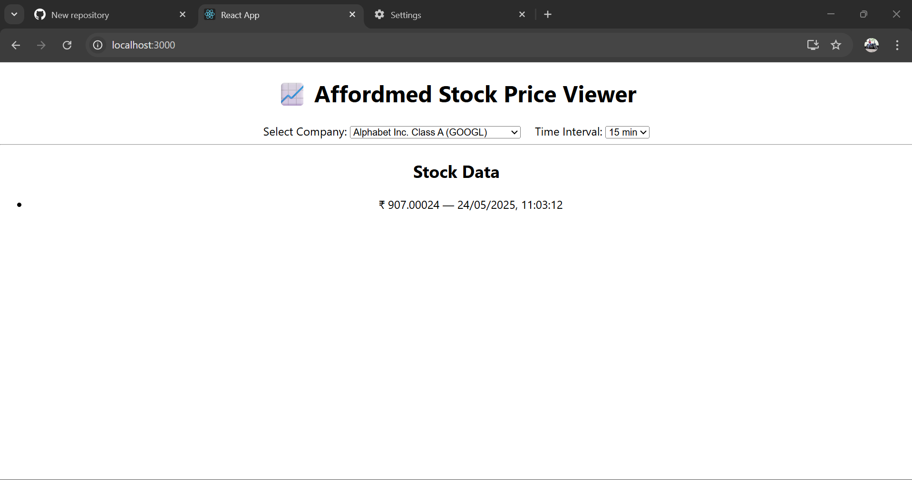

# 💼 Affordmed Frontend Test Submission

## 👨‍🎓 Name: Vigneshwaran N K  
## 🆔 Roll Number: 927622bcs118  

---

## ✅ Q1: 📈 Stock Price Viewer (React App)

### 🚀 Description:
A frontend web app to view real-time stock prices based on company selection and time intervals. Built as part of Affordmed's frontend evaluation using authorized APIs.

### 🔧 Tech Stack:
- React.js (Hooks)
- Axios (for API requests)
- HTML5 + CSS3
- JavaScript (ES6)

---

## 🗂️ Folder Structure
Q1/
├── frontend/
│ ├── public/
│ ├── src/
│ ├── screenshots/
│ │ └── GOOGL-15min.png ✅
│ ├── package.json
│ ├── README.md

---

## ⚙️ Features

- 🔎 Company dropdown with tickers
- ⏱️ Time interval selection (15/30/60 min)
- 📊 Dynamic API call and display of price data
- 🛠️ CORS-compliant Axios headers with Bearer token
- 🧪 Tested manually with Postman before coding

---

## 🧪 Screenshot

### 🖼️ Sample Output (GOOGL - 15 min)

---

## 🔐 API Used

- **GET /stocks** – To list all companies
- **GET /stocks/{ticker}?minutes={value}** – To fetch price data

---

## ⚠️ Notes

- Used `Bearer <access_token>` in the Axios headers.
- No backend or database — purely frontend with test server APIs.
- All work was done under the Affordmed test environment with local testing at `http://localhost:3000`.

---

## 📫 Contact

- 📧 Email: vigneshkanra@gmail.com  
- 🌐 GitHub: [vigneshkanraS](https://github.com/vigneshkanraS)
- 💼 Portfolio: [Click Here](https://yogeshneelamegam15.my.canva.site/vigneshkanra)

---

