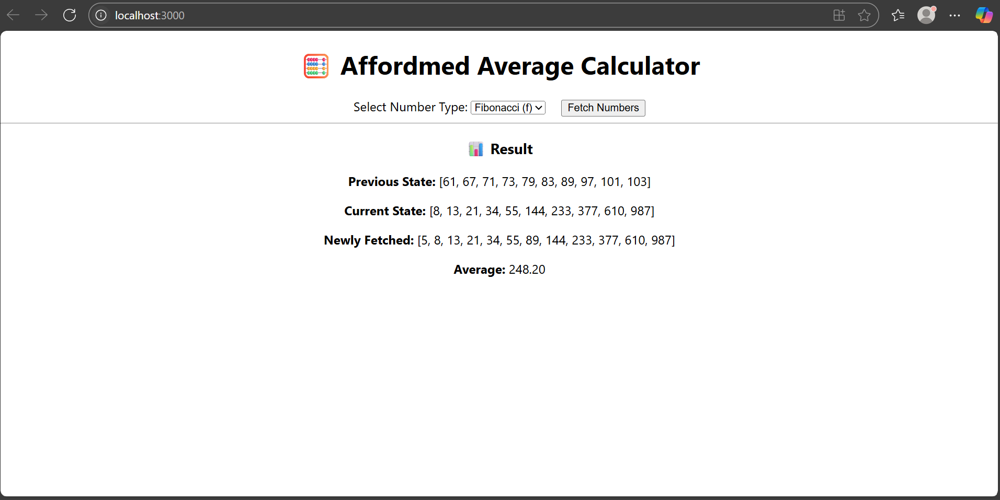
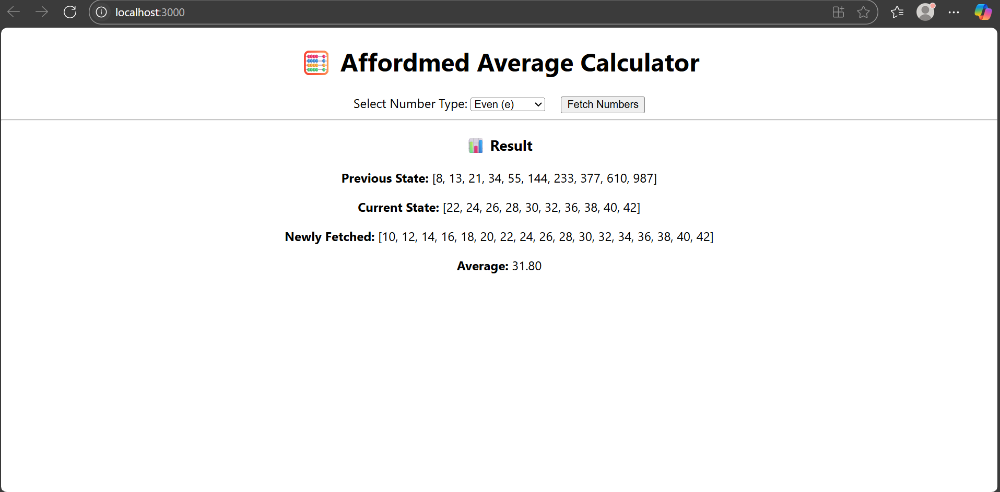
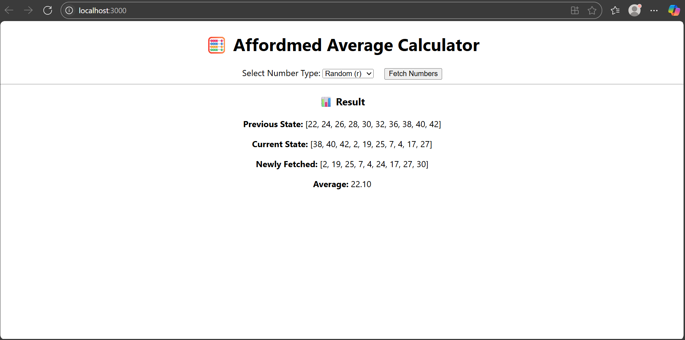

# 🧮 Affordmed Average Calculator – Q2

## 👨‍🎓 Name: Vigneshwaran N K  
## 🆔 Roll Number: 927622bcs118  

---

## 📄 Description

This is a frontend microservice app that:
- Fetches numbers (Prime, Fibonacci, Even, Random) from the authorized API
- Maintains a **sliding window** of **10 unique numbers**
- Displays:
  - 🟡 Previous state
  - 🔵 Current state
  - 🟢 Newly fetched numbers
  - 📊 Calculated average of current state

---

## ⚙️ Tech Stack

- ⚛️ React.js
- 📦 Axios
- 💡 JavaScript (ES6)
- ⏱ API Timeout control (500ms)
- 🔐 Bearer Token Authentication

---

## 💡 How It Works

1. User selects the type of numbers (p/f/e/r).
2. App fetches new values from `http://20.244.56.144/evaluation-service/{numberid}`.
3. Stores unique values up to window size (10).
4. If already full, replaces the **oldest values** with new ones.
5. Recalculates the average and displays the updated view.

---

## 🧪 Screenshots

### 🔢 Prime Numbers (p)

### 🧬 Fibonacci Numbers (f)

### ⚖️ Even Numbers (e)

### 🎲 Random Numbers (r)

---

## 📁 Folder Structure
Q2/
├── frontend/
│ ├── public/
│ ├── src/
│ ├── screenshots/
│ │ ├── Q2-prime.png
│ │ ├── Q2-fibonnic.png
│ │ ├── Q2-even.png
│ │ ├── Q2-random.png
│ ├── package.json
│ └── README.md

---

## 🔐 API Endpoint Format
> Valid `numberid` values:  
> - `primes` → Prime numbers  
> - `fibo` → Fibonacci numbers  
> - `even` → Even numbers  
> - `rand` → Random numbers  

---

## 📝 Notes

- ⏱ Requests strictly timeout after **500ms** to comply with challenge rules.
- ❌ Skips duplicates using `Set()`.
- 📈 Average is calculated live after every API fetch.
- ✅ Fully tested with Postman before development.

---

## 📫 Contact

- 📧 Email: vigneshkanra@gmail.com  
- 🌐 GitHub: [vigneshkanraS](https://github.com/vigneshkanraS)  
- 💼 Portfolio: [View Portfolio](https://yogeshneelamegam15.my.canva.site/vigneshkanra)

---
